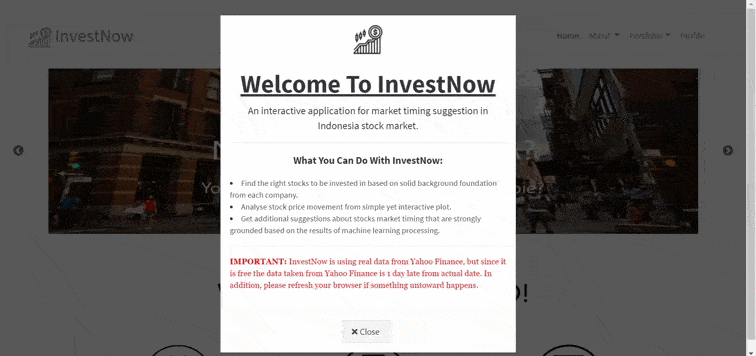

# InvestNow

This is my project for Data Career Day at Algoritma School of Data Sciece. In this project I created a machine learning that can classify whether today an investor should buy or sell their stock.

This project was create to provide benefits to 3 parties: 
- Brokers can take advantage of this project as a feature to attract new investors to invest in stocks.
- Investors (individuals) can take advantage of this project to get additional income.
- The state will also benefit from this project since if the investors income increases, the income of the country will also increase.

More detailed background (Bahasa Indonesia): https://rpubs.com/VicNP/proposal-dcd

Live Demo : https://vicnp.shinyapps.io/InvestNow/ (Archived - Under Maintenance)

# InvestNow - Behind The Scene

InvestNow was built in [R](https://www.r-project.org) , an open source programming language using the [Shiny package](https://shiny.rstudio.com), a web application framework for R. Users will need to download [R](https://cran.uni-muenster.de/) in order to use InvestNow and we suggest the use of [RStudio](https://www.rstudio.com). R is completely free to use. All required code and library used can be found in this github repositroy.

For better understanding about step to step how to built InvestNow from collecting data - EDA - machine learning modeling, can be read [here](https://rpubs.com/VicNP/stock-market-timing-suggest).

## Input Variable 

InvestNow is using real data from Yahoo Finance, <b><i>but since it is free the data taken from Yahoo Finance is 1 day late from actual date</b></i>.

| Variable             	| Detail                                                                           	|
|----------------------	|----------------------------------------------------------------------------------	|
| symbol | Abreviation/symbol of the stock to be predicted |
| date | Stock price date history (YYYY-MM-DD) |
| open | The position of the stock price at the opening on that day |
| high | The position of the stock price at the highest on that day |
| low | The position of the stock price at the lowest on that day   |
| close | The position of the stock price at the closing on that day |
| volume | The total number of stock volumes on that day |
| adjusted | The same as the position of the share price per share at the last time that occurred on that day but adjusted to the prevailing dividend distribution |

## Exploratory Data Analysis

Technical analysis is a way of analyzing price movements in the stock market using statistical tools, such as charts and mathematical formulas.

In this project there are 4 kinds of technical analysis that will be used:
- Simple Moving Average (SMA)
- Exponential Moving Average (EMA)
- Moving Average Convergence Divergence (MACD)
- Relative Strength Index (RSI)

The 4 types of technical analysis above will be used to obtain the required predictors and target variables in the form of decisions to Buy, Hold or Sell which will be used later to create machine learning models. Because the target variable is very crucial for training the machine learning model that will be used later, the technical analysis of the five methods above will be carried out as perfectly as possible to avoid mistakes in making decisions.

## Machine Learning Model

After getting all the target variables needed through the EDA process and prepared in data pre-processing, the next thing to do is start the machine learning modeling process. There will be two models developed in this project to be compared which model is the best, those models are called <b>Decision Tree</b> and <b>Random Forest</b>.

Decision Tree and Random Forest are categorized as a classification model, which very suitable for this project since the main goal of this project to built a machine learning project which capable to classify whether today is it the right time for the investor to open position, close the position or keep position until the right time.

But based on data train and data test confusion matrix results from both model, model decision tree and random forest produce good prediction performance result on data train but only model decision tree which can produce stable performance when evaluated using data test, while model random forest often make prediction errors when evaluated using the data test. So the final model used in this application is <b><u>Decision Tree Model</b></u>.
